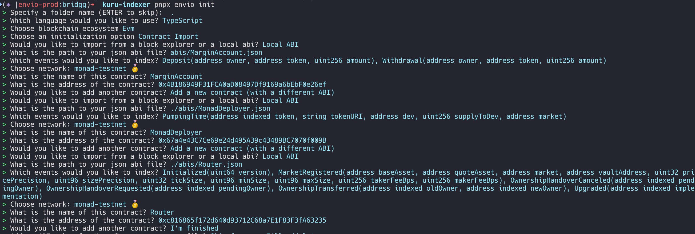

# Envio Kuru Indexer

## Run 

```bash
pnpm envio dev
```
 
https://docs.kuru.io/developers/contracts
https://github.com/Kuru-Labs/kuru-sdk/tree/main/abi

## init flow



*Please refer to the [documentation website](https://docs.envio.dev) for a thorough guide on all [Envio](https://envio.dev) indexer features*

